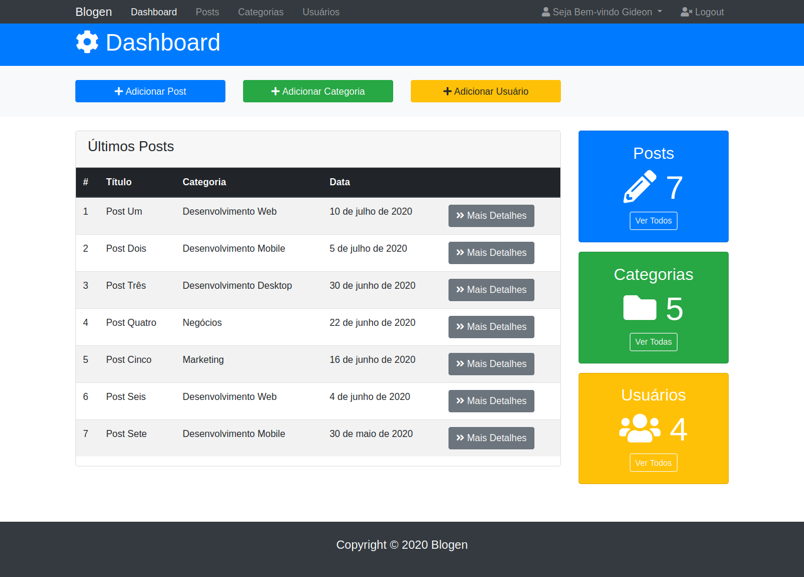

# dashboard-blogen-theme

## Project

***EN:*** This project is a front-end of an administrative panel for blog management, a simple yet complete dashboard that can be easily implemented due to its versatility. It was created during the Bootstrap 4 From Scratch With 5 Projects course, taught by Brad Traversy.

***PT-BR:*** Este projeto é um front-end de um painel administrativo para gerenciamento de blogs, um painel simples, porém completo, que pode ser facilmente implementado devido à sua versatilidade. Foi criado durante o curso Bootstrap 4 From Scratch With 5 Projects, ministrado por Brad Traversy.

## Specifications
- Added a dashboard with some actions, list of latest post and info cards with total categories, posts & users
- Added a posts page with all posts and a search bar of post
- Added a categories page with all categories and a search bar of category
- Added a users page with all users and a search bar of user
- Added a details page with an example of edit post content and two actions, save changes and delete post
- Added a settings page
- Added a profile page with actions like change password, delete account, change avatar, delete avatar, edit name / email or bio
- Added a login page
***

## Technologies

This project was developed with the following technologies:

- HTML
- CSS
- Bootstrap
***
 
## Preview

***

## License

This project is under the MIT license.
